[](https://laravel.com) [](https://php.net) [](https://github.com/yourusername/erp-app/actions) [](LICENSE)

# 🚀 ERP App

A Laravel-powered ERP suite for managing **Clients**, **Suppliers**, **Products**, **Orders**, and **Invoices**—complete with role-based access control, PDF invoicing, custom validation, and a modern Bootstrap 5 interface.

---

## 📌 Table of Contents

* [✨ Key Features](#key-features)
* [🛠️ Tech Stack](#tech-stack)
* [📁 Project Structure](#project-structure)
* [⚙️ Installation](#installation)
* [🔧 Configuration](#configuration)
* [▶️ Running the App](#running-the-app)
* [👤 Default Admin](#default-admin)
* [📸 Screenshots](#screenshots)
* [🔒 Permissions & Middleware](#permissions--middleware)
* [📄 License](#license)

---

## ✨ Key Features

* 🔐 **Authentication & Role Management**
  Laravel Breeze scaffolding (Sanctum-ready), invite-only registration via single-use codes, `admin` / `user` roles enforced by Gates/Policies.
* 🤝 **Clients & Suppliers**
  Full CRUD with soft deletes, quick filters, and unique NIP/email validation.
* 📦 **Product Catalog**
  Supplier linkage, price tracking history, CSV/Excel import & export.
* 🛒 **Order Workflow**
  Many‑to‑many `order_product` pivot including quantity, buy & sell price; automatic subtotal and tax calculation.
* 📄 **PDF Invoicing**
  One‑click, brand‑ready PDF generation using `barryvdh/laravel-dompdf`; optional email attachment.
* ✔️ **Custom Validation**
  Centralised `FormRequest` classes with >5 custom rules (NIP checksum, positive price, positive quantity, max length, future date disallowed).
* 🔍 **Search & Filtering**
  Global full‑text search across clients, suppliers & products; sortable & paginated tables.
* 📊 **Admin Dashboard**
  Registration‑code management, KPI widgets, and activity‑log observers.
* 🧰 **Developer Friendly**
  Clean MVC architecture, service classes, repository pattern, feature tests, Docker & CI workflow.

---

## 🛠️ Tech Stack

| Layer         | Technology                                       |
| ------------- | ------------------------------------------------ |
| **Framework** | Laravel 10 (PHP ≥ 8.2)                           |
| **Database**  | MySQL / MariaDB – Eloquent ORM                   |
| **Auth**      | Laravel Breeze, Gates & Policies                 |
| **Frontend**  | Blade, Bootstrap 5, Vite/ESBuild, Livewire‑ready |
| **PDF**       | barryvdh/laravel-dompdf                          |
| **Testing**   | PHPUnit, Laravel Pint / PHPStan                  |
| **CI/CD**     | GitHub Actions (build, test, Pint, deploy)       |

---

## 📁 Project Structure

```text
app/
├── Models/
├── Http/
│   ├── Controllers/
│   ├── Requests/
│   └── Middleware/
├── Policies/
database/
├── migrations/
├── seeders/
public/
resources/
├── views/
│   ├── clients/
│   ├── suppliers/
│   ├── products/
│   ├── orders/
│   └── invoices/
routes/
├── web.php
└── api.php
```

---

## ⚙️ Installation

### 🔑 Prerequisites

* **PHP 8.2+** with extensions: BCMath, Ctype, Fileinfo, JSON, Mbstring, OpenSSL, PDO, Tokenizer, XML
* **Composer v2**
* **Node.js 18+** & **npm**
* **MySQL** or **MariaDB**
* *(Optional)* **Docker & Docker Compose** for containerised local setup

### 🏃‍♂️ Quick start

```bash
git clone https://github.com/yourusername/erp-app.git
cd erp-app

# PHP dependencies
composer install --prefer-dist --no-dev

# Environment variables
cp .env.example .env
php artisan key:generate

# Database & seeders
php artisan migrate --seed

# Front‑end assets
npm install
npm run build

# Fire up the dev server
php artisan serve
```

Open `http://127.0.0.1:8000` in your browser and log in with the [default admin](#-default-admin) credentials.

> **Docker**
> Run `./vendor/bin/sail up -d` or simply `docker compose up -d` to spin up a full stack (PHP‑FPM, Nginx, MySQL, Mailhog) in containers.

## 🔧 Configuration

| Variable        | Purpose                             |
| --------------- | ----------------------------------- |
| `APP_NAME`      | Branding shown in PDFs & navbar     |
| `MAIL_*`        | SMTP credentials for invoice emails |
| `DB_*`          | Database connection strings         |
| `PDF_LOGO_PATH` | Path to logo used in invoices       |

---

## ▶️ Running the App

```bash
php artisan serve    # default http://127.0.0.1:8000
```

Visit `/login` and use the default admin credentials below.

---

## 👤 Default Admin

| Email               | Password   |
| ------------------- | ---------- |
| `admin@example.com` | `password` |

*(created by DatabaseSeeder; change immediately in production).*

---

## 📸 Screenshots

| #  | Screenshot                       | Description                                |
| -- | -------------------------------- | ------------------------------------------ |
| 1  | 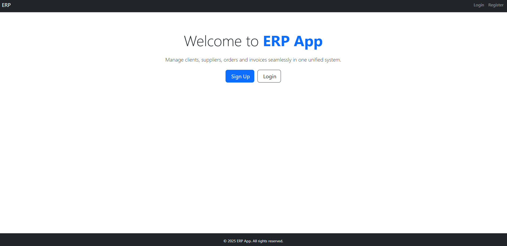           | Welcome page with login/register           |
| 2  | 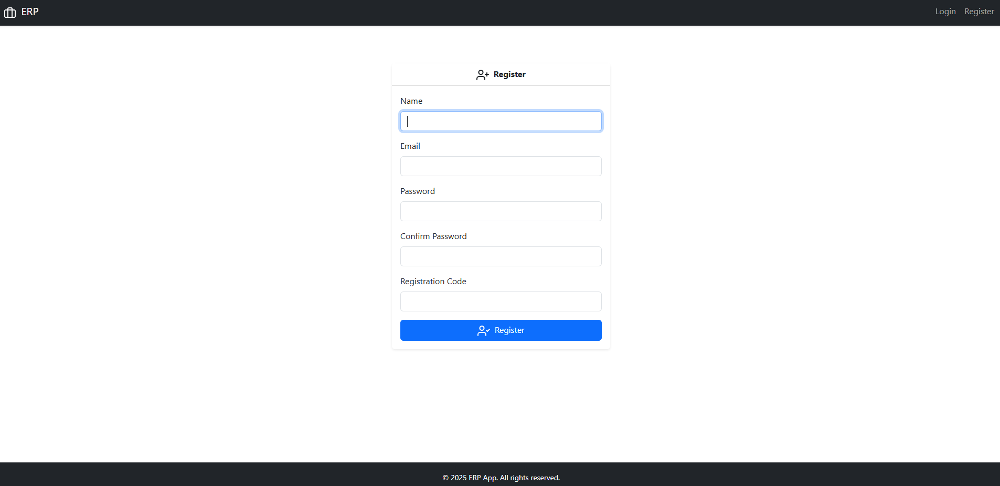          | Registration form with invite code         |
| 3  | 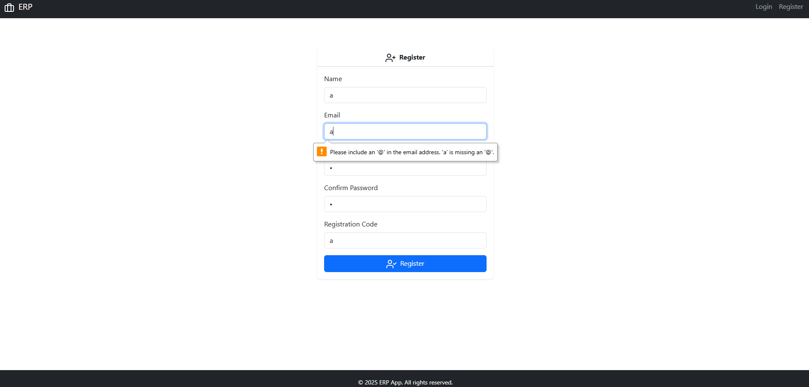     | Client-side validation                     |
| 4  | 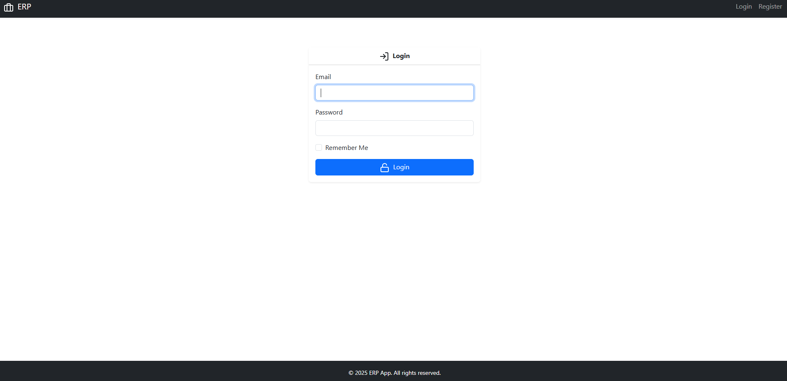             | Login form                                 |
| 5  | 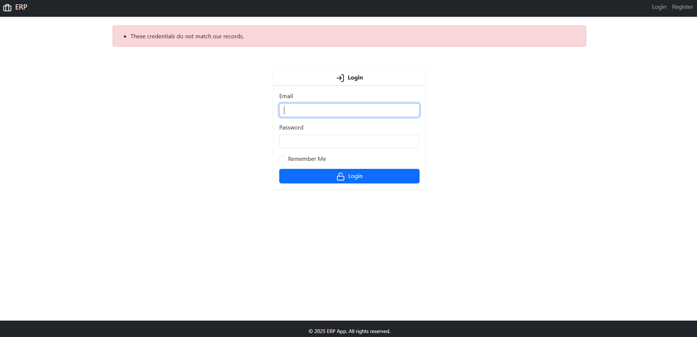        | Server-side auth error                     |
| 6  |     | KPI cards for staff                        |
| 7  | 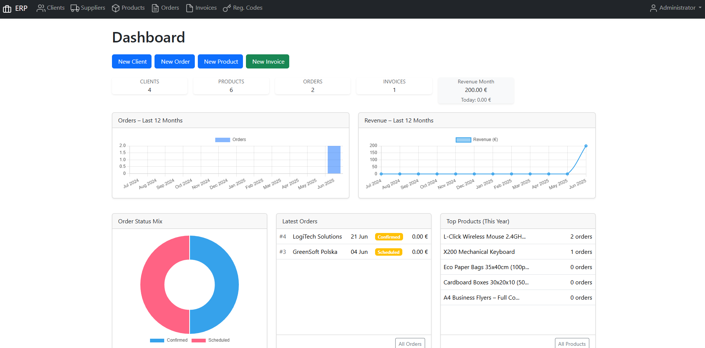    | Admin dashboard with code management       |
| 8  | 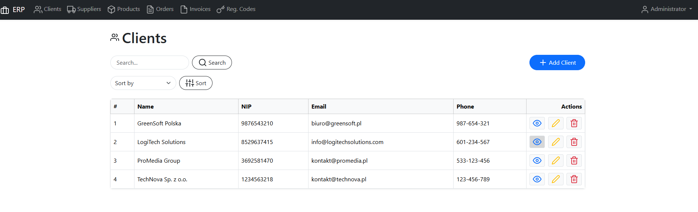        | Client list CRUD                           |
| 9  | 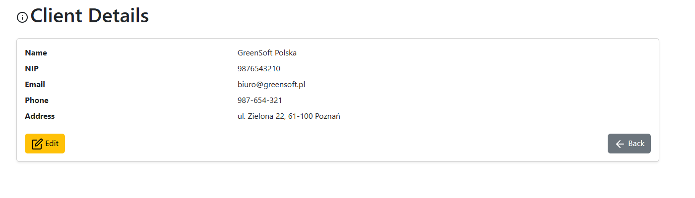      | Single client details view                 |
| 10 |     | Supplier CRUD with filters                 |
| 11 | 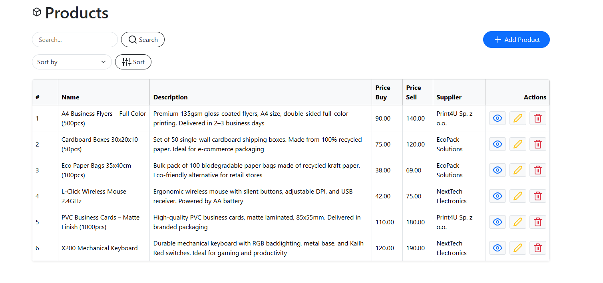      | Product catalog                            |
| 12 | 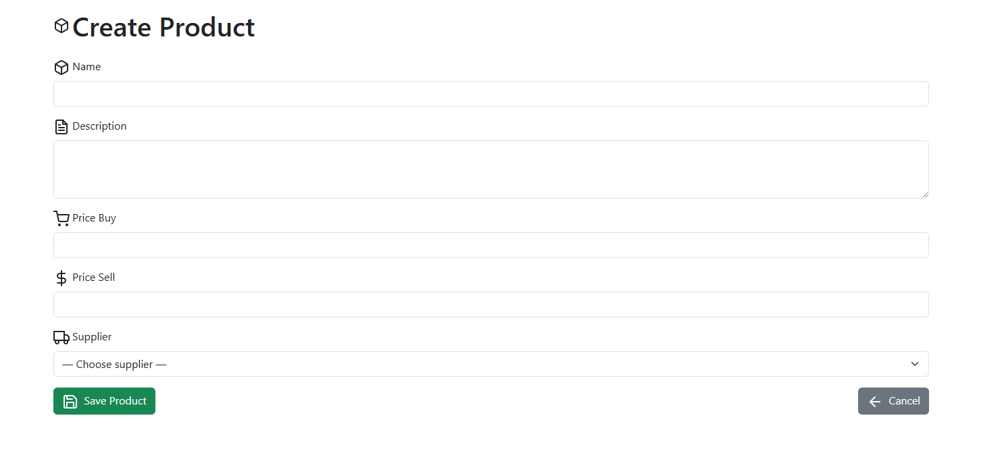    | Add product form with validation           |
| 13 | 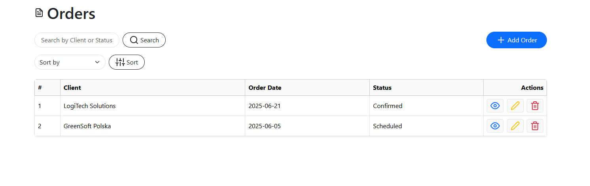        | Order list with statuses                   |
| 14 | 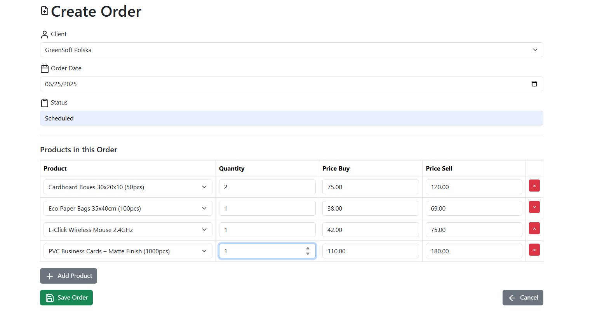      | Create order with multiple products        |
| 15 |  | Validation: order date cannot be in future |
| 16 | 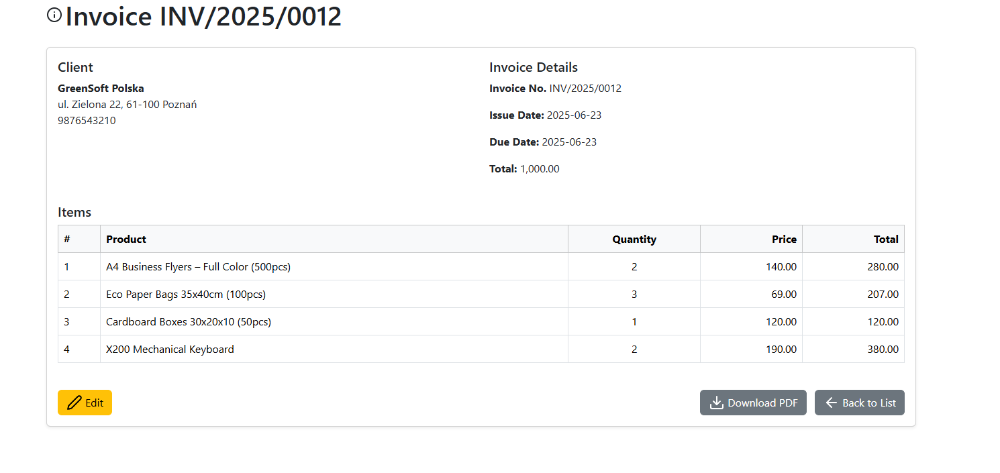      | Invoice detail view with PDF button        |
| 17 | 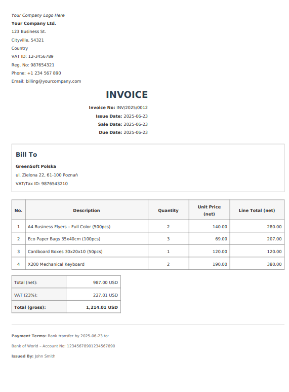     | Branded invoice PDF                        |
| 18 | 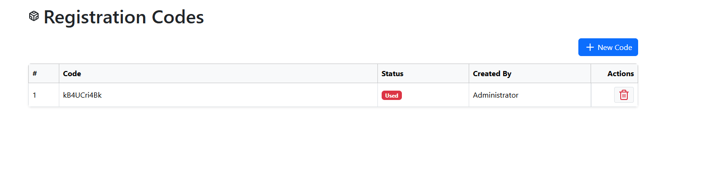 | Admin invite code management               |

## 🔒 Permissions & Middleware & Middleware

```php
Route::middleware(['auth'])->group(function () {
    Route::get('/dashboard', [DashboardController::class, 'index']);
    Route::resource('clients', ClientController::class);
    Route::resource('suppliers', SupplierController::class);
    Route::resource('products', ProductController::class);
    Route::resource('orders', OrderController::class);
    Route::resource('invoices', InvoiceController::class);

    Route::middleware('can:admin-only')->group(function () {
        Route::resource('registration-codes', RegistrationCodeController::class);
    });
});
```

* `auth` – protects all routes
* `can:admin-only` – gate for admin features
* Blade directives: `@auth`, `@can`, `@role`

---

## 📄 License

This project is open‑source software licensed under the [MIT license](LICENSE).

---

*of course update links, images & variables to match your deployment.*
