[](https://laravel.com)
[](https://www.php.net/)
[](https://www.mysql.com/)
[](https://docs.docker.com/compose/)
[](LICENSE)

# 🚀 ERP App

A Laravel-powered ERP suite for managing **Clients**, **Suppliers**, **Products**, **Orders**, and **Invoices** — with role-based access, PDF invoicing, custom validation, and a modern Bootstrap 5 UI.

---

## 📌 Table of Contents
- [✨ Key Features](#key-features)
- [🛠️ Tech Stack](#tech-stack)
- [📁 Project Structure](#project-structure)
- [⚙️ Installation](#installation)
- [🔧 Configuration](#configuration)
- [▶️ Running the App](#running-the-app)
- [👤 Default Admin](#default-admin)
- [📸 Screenshots](#screenshots)
- [🔒 Permissions & Middleware](#permissions--middleware)
- [📄 License](#license)

---

<h2 id="key-features">✨ Key Features</h2>

- 🔐 **Authentication & Roles** — Laravel Breeze (Sanctum-ready), invite-only registration (single-use codes), `admin` / `user` via Gates/Policies.  
- 🤝 **Clients & Suppliers** — full CRUD, soft deletes, quick filters, unique NIP/email validation.  
- 📦 **Products** — supplier linkage, price history, CSV/Excel import/export.  
- 🛒 **Orders** — many-to-many `order_product` (qty, buy/sell price), subtotal & tax calculation.  
- 📄 **PDF Invoices** — one-click PDFs via `barryvdh/laravel-dompdf`, optional email attachment.  
- ✔️ **Custom Validation** — central `FormRequest` + reguły: NIP checksum, positive price/qty, max length, no future dates.  
- 🔍 **Search & Filters** — global search, sortable & paginated tables.  
- 📊 **Admin Dashboard** — KPI widgets, registration-code management, activity log.  
- 🧰 **Developer Friendly** — czysty MVC, serwisy, repozytoria, gotowy setup pod Docker.

---

<h2 id="tech-stack">🛠️ Tech Stack</h2>

| Layer         | Technology                                       |
|---------------|---------------------------------------------------|
| **Framework** | Laravel 10 (PHP ≥ 8.2)                           |
| **Database**  | MySQL / MariaDB — Eloquent ORM                   |
| **Auth**      | Laravel Breeze, Gates & Policies                 |
| **Frontend**  | Blade, Bootstrap 5, Vite/ESBuild, Livewire-ready |
| **PDF**       | barryvdh/laravel-dompdf                          |
| **Lint/QA**   | Laravel Pint, PHPStan                            |

---

<h2 id="project-structure">📁 Project Structure</h2>
```text
app/
├── Models/
├── Http/
│   ├── Controllers/
│   ├── Requests/
│   └── Middleware/
├── Policies/
database/
├── migrations/
├── seeders/
public/
resources/
├── views/
│   ├── clients/
│   ├── suppliers/
│   ├── products/
│   ├── orders/
│   └── invoices/
routes/
├── web.php
└── api.php
```

---

<h2 id="installation">⚙️ Installation</h2>

### 🔑 Prerequisites

* **PHP 8.2+** with extensions: BCMath, Ctype, Fileinfo, JSON, Mbstring, OpenSSL, PDO, Tokenizer, XML
* **Composer v2**
* **Node.js 18+** & **npm**
* **MySQL** or **MariaDB**
* **Docker & Docker Compose** for containerised local setup

### 🏃‍♂️ Quick start

```bash
git clone https://github.com/Adrioanowskii/erp-app.git
cd erp-app

# PHP dependencies
composer install --prefer-dist --no-dev

# Environment variables
cp .env.example .env
php artisan key:generate

# Database & seeders
php artisan migrate --seed

# Front‑end assets
npm install
npm run build

# Fire up the dev server
php artisan serve
```

Open `http://127.0.0.1:8000` in your browser and log in with the [default admin](#-default-admin) credentials.

> **Docker**
> Run `./vendor/bin/sail up -d` or simply `docker compose up -d` to spin up a full stack (PHP‑FPM, Nginx, MySQL, Mailhog) in containers.

<h2 id="configuration">🔧 Configuration</h2>

| Variable        | Purpose                             |
| --------------- | ----------------------------------- |
| `APP_NAME`      | Branding shown in PDFs & navbar     |
| `MAIL_*`        | SMTP credentials for invoice emails |
| `DB_*`          | Database connection strings         |
| `PDF_LOGO_PATH` | Path to logo used in invoices       |

---

<h2 id="running-the-app">▶️ Running the App</h2>

```bash
php artisan serve    # default http://127.0.0.1:8000
```

Visit `/login` and use the default admin credentials below.

---

<h2 id="default-admin">👤 Default Admin</h2>

| Email               | Password   |
| ------------------- | ---------- |
| `admin@example.com` | `Admin123!` |

*(created by DatabaseSeeder; change immediately in production).*

---

<h2 id="screenshots">📸 Screenshots</h2>

| #  | Screenshot                       | Description                                |
| -- | -------------------------------- | ------------------------------------------ |
| 1  | 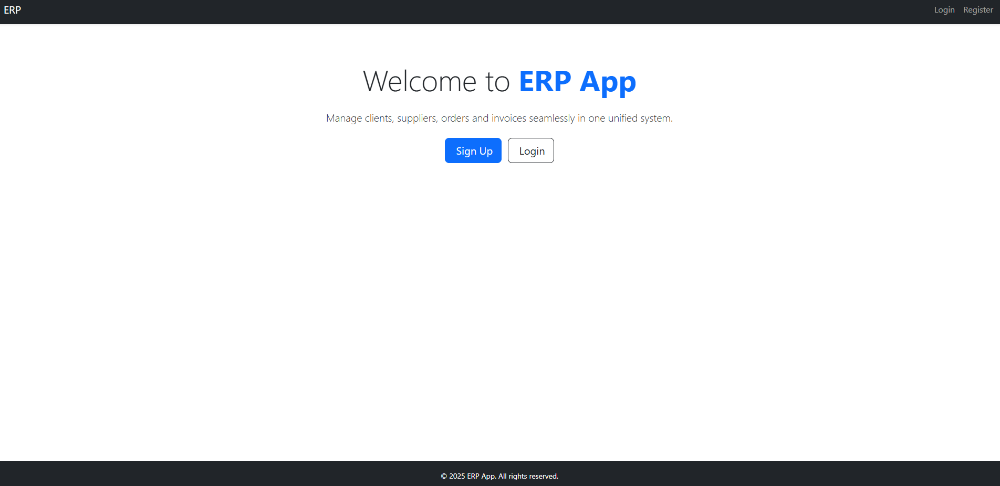           | Welcome page with login/register           |
| 2  | 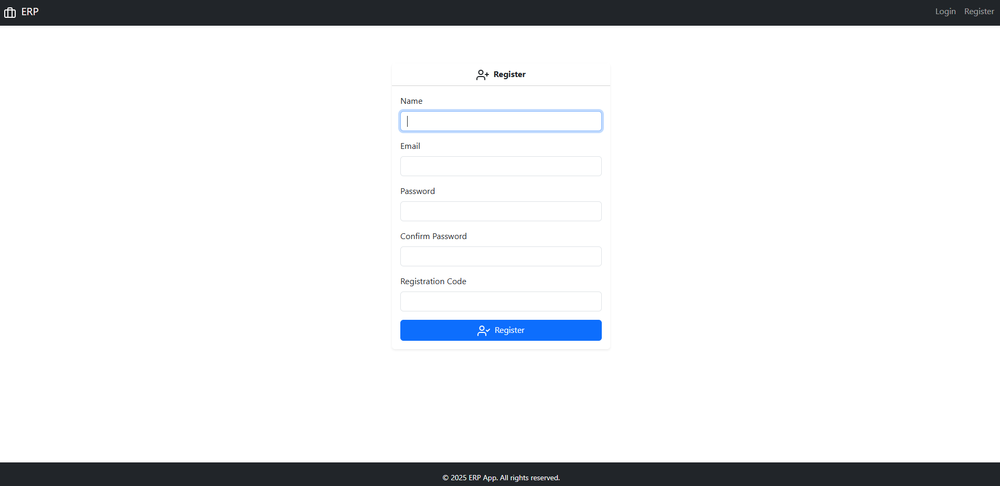          | Registration form with invite code         |
| 3  | 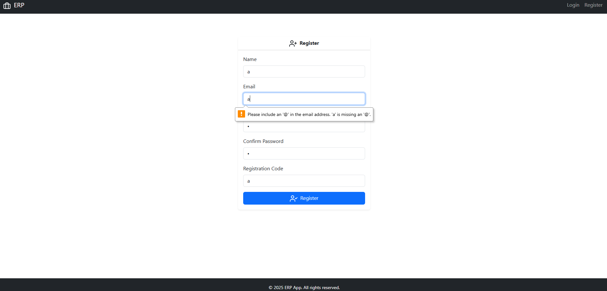     | Client-side validation                     |
| 4  | 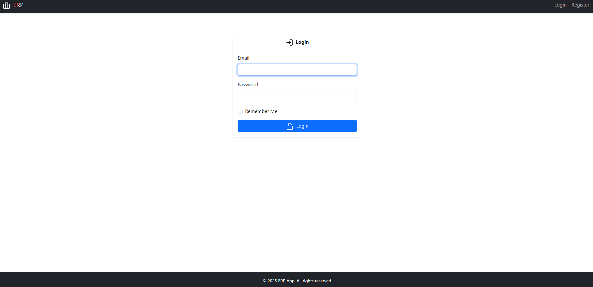             | Login form                                 |
| 5  | 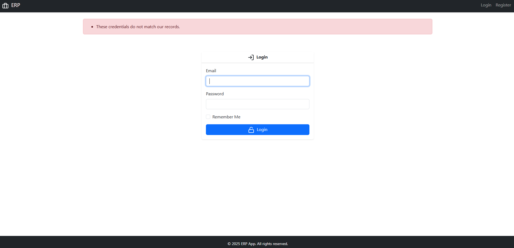        | Server-side auth error                     |
| 6  |     | KPI cards for staff                        |
| 7  | 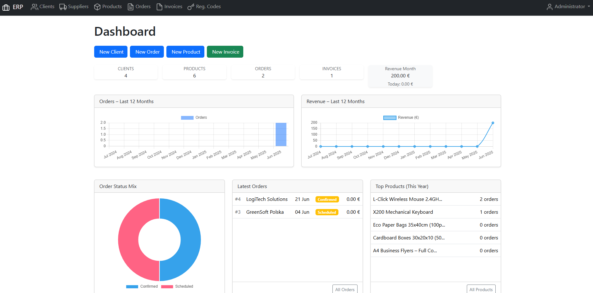    | Admin dashboard with code management       |
| 8  | 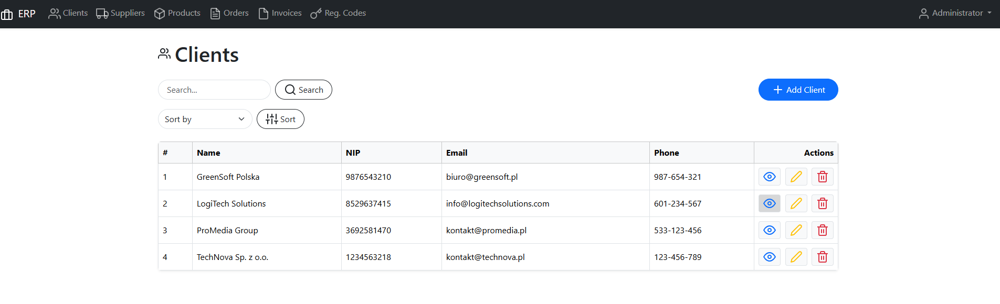        | Client list CRUD                           |
| 9  | 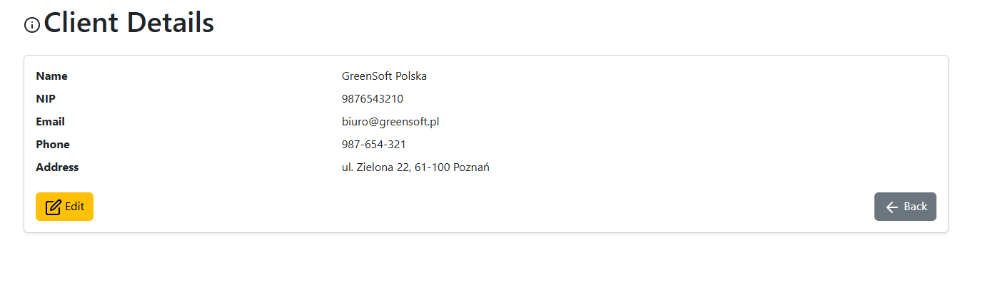      | Single client details view                 |
| 10 |     | Supplier CRUD with filters                 |
| 11 | 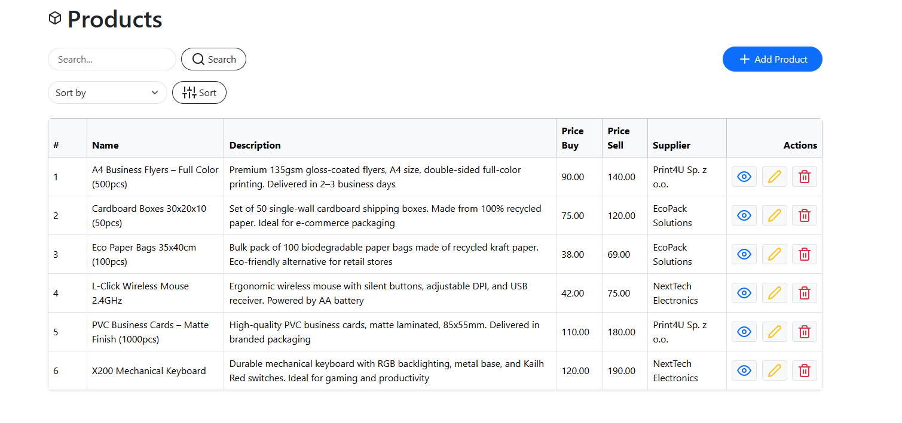      | Product catalog                            |
| 12 | 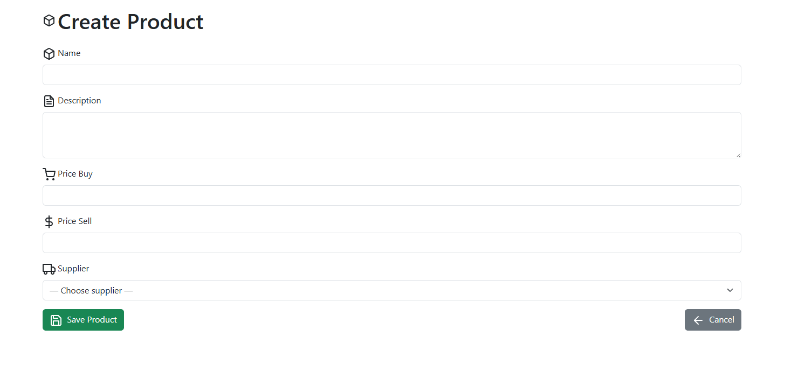    | Add product form with validation           |
| 13 | 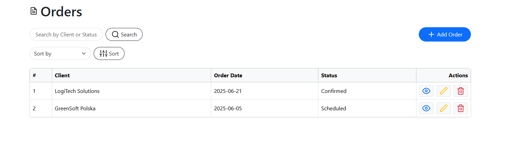        | Order list with statuses                   |
| 14 | 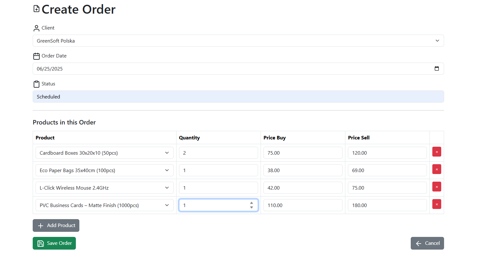      | Create order with multiple products        |
| 15 | 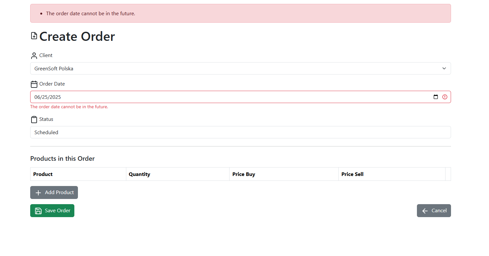 | Validation: order date cannot be in future |
| 16 | 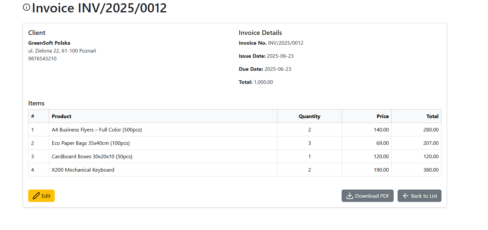      | Invoice detail view with PDF button        |
| 17 | 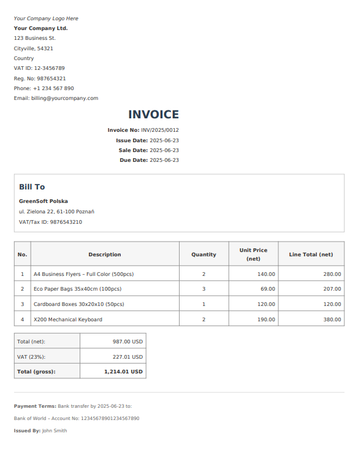     | Branded invoice PDF                        |
| 18 | 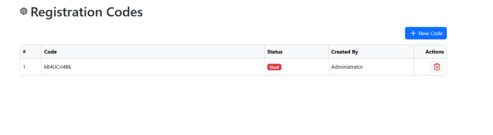 | Admin invite code management               |

<h2 id="permissions--middleware">🔒 Permissions & Middleware</h2>

```php
Route::middleware(['auth'])->group(function () {
    Route::get('/dashboard', [DashboardController::class, 'index']);
    Route::resource('clients', ClientController::class);
    Route::resource('suppliers', SupplierController::class);
    Route::resource('products', ProductController::class);
    Route::resource('orders', OrderController::class);
    Route::resource('invoices', InvoiceController::class);

    Route::middleware('can:admin-only')->group(function () {
        Route::resource('registration-codes', RegistrationCodeController::class);
    });
});
```

* `auth` – protects all routes
* `can:admin-only` – gate for admin features
* Blade directives: `@auth`, `@can`, `@role`

---

<h2 id="license">📄 License</h2>

This project is open‑source software licensed under the [MIT license](LICENSE).

---

*of course update links, images & variables to match your deployment.*
